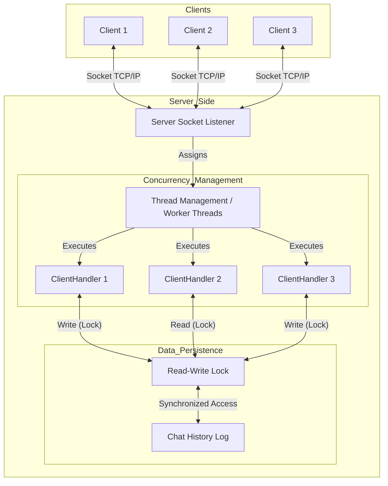

# Java Multithreaded Chat System

## Overview
This project is a high-concurrency, real-time chat application implemented in Java. It demonstrates a robust **Client-Server architecture** capable of handling multiple users simultaneously through **multithreading** and **synchronization mechanisms**.

The system is designed to showcase core Computer Science concepts such as network programming with Sockets, concurrent resource management, thread safety, and Object-Oriented Design (OOD) principles. It was developed to meet rigorous technical standards, suitable for analyzing distributed systems and concurrency control.

## System Architecture

The application follows a modular design separating the Connection Layer, Business Logic Layer, and Data Persistence Layer.

### Architecture Diagram



## Key Technical Highlights

### 1. Client-Server Architecture
- **Implementation**: Utilizes Java's `java.net.Socket` and `java.net.ServerSocket` for reliable TCP connections.
- **Protocol**: Custom application-level protocol for handling message types (Private, Group, Commands).
- **Functionality**: The Server listens on a specific port (default: 5000) and accepts incoming client connections, offloading each connection to a dedicated handler.

### 2. Concurrency Management
- **Multithreading**: The server employs a multithreaded model to handle blocking I/O operations. Each client connection is encapsulated in a `ClientHandle` object running on its own thread, ensuring that one client's activity does not block others.
- **Scalability**: The design supports `ExecutorService` (Thread Pools) patterns to manage worker threads efficiently, preventing resource exhaustion under high load.

### 3. Data Consistency & Synchronization
- **Challenge**: Multiple threads attempting to write to or read from the shared chat history file (`Save_file.txt`) simultaneously can cause race conditions and data corruption.
- **Solution**: Implemented `java.util.concurrent.locks.ReentrantReadWriteLock`.
    - **Read Lock**: Allows multiple threads to search/read the chat history concurrently (High throughput).
    - **Write Lock**: Ensures exclusive access for a single thread when writing new messages to the log (Data integrity).
- **Outcome**: This strict locking mechanism guarantees **ACID-like properties** for file operations within the application context.

### 4. Object-Oriented Design (OOD)
- **Modularity**:
    - `Server`: Manages lifecycle and connections.
    - `Client`: Handles user UI (command line) and networking.
    - `ClientHandle`: Encapsulates server-side logic for a specific user (Runnable interface).
    - `ClientListen`: Separates the "listening for incoming messages" task on the client side to keep the UI responsive.
- **Interface Segregation**: Uses `Runnable` interface to decouple task definition from thread execution.

## Features
- **Group Chat**: Broadcast messages to all connected users.
- **Private Chat**: Direct messaging to specific users via ID.
- **Message Persistence**: Auto-saving of chat history.
- **Search**: Search through chat logs with keywords.
- **Recall**: Message revocation functionality.
- **Online Status**: Check connected users.

## Getting Started

### Prerequisites
- Java Development Kit (JDK) 17 or higher
- Maven (for dependency management)

### Installation
1. Clone the repository:
   ```bash
   git clone https://github.com/RicharMd/Java-Multithreaded-Chat-System.git
   ```
2. Navigate to the project directory.

### Running the Application

**1. Start the Server**
Run the `Main` class to start the server listener.
```bash
# Example command if using CLI
java -cp target/classes org.example.Main
```
*The server will start listening on port 5000.*

**2. Start a Client**
Run the `CreatClient` class (or `Client` entry point) to connect.
```bash
# Open a new terminal window
java -cp target/classes org.example.CreatClient
```
*Follow the on-screen prompts to enter your username and start chatting.*

## Project Structure
```
src/main/java/org/example/
├── Client.java        # Client-side networking logic
├── ClientListen.java  # Client-side incoming message listener thread
├── Server.java        # Server entry point and connection acceptor
├── ClientHandle.java  # Server-side worker for individual clients
├── Main.java          # Server starter
└── CreatClient.java   # Client starter helper
```

